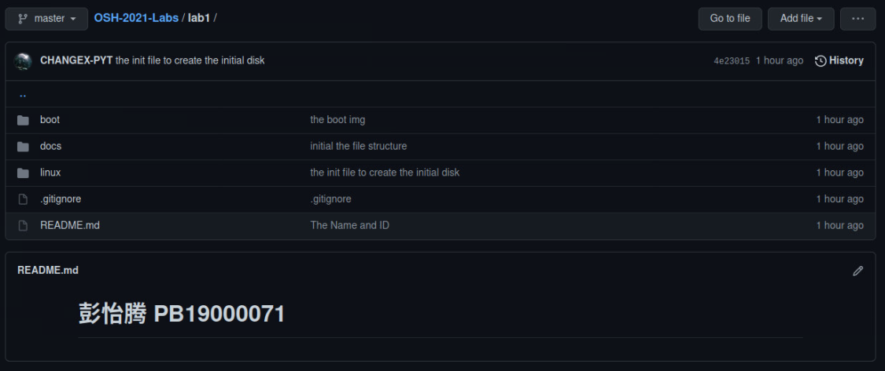

# 实验报告

## 1、GIT

​	使用git将代码等文件上传到lab1的目录下面。

​	基本步骤：

​	1、使用git config配置用户信息，再使用ssh-keygen生成SSH密钥，并将生成的密钥配置到GitHub中，完成传输文件前基本的配置。

​	2、对文件夹使用git init初始化，创建项目仓库，通过git remote add ...... .git关联远程库。

​	3、使用git add添加需要传输的文件，使用git commit添加更新的提示信息，最后使用git push成功上传代码等文件。

​	

## 2、LINUX内核

使用图形化的config配置页面对内核进行裁剪，在不影响1、2、3程序执行的前提下删去了尽可能多的对执行此三个程序不必要的功能：如全部的网络系统，全部的文件系统，全部的安全加密模块等，同时使用了节约空间而非优化性能的编译方式，使得最终的内核大小能满足小于6MB的实验要求。

最终裁剪大小在Linux系统下显示为5.6MB，在Windows系统下显示为5.3MB。经过测试，如果删除调试功能，使内核在执行程序时只输出程序显示的信息，不显示其他的调试信息，还可再减少0.4MB左右的大小。

内核大小如下：

运行状态见下文“初始内存盘” 部分配图。

## 3、初始内存盘

通过创立initrd文件的方式建立了初始内存盘，并使得内核在一开始运行的时候就执行我们的用户程序：init.c

init.c主要做了以下两件事：

1、创建设备文件，为后面调用1、2、3的测试程序做铺垫。

2、使用fork+execv函数的方式调用外部的1，2，3三个程序，完成测试。

init.c代码已置于linux/src目录下。

测试结果如下：

## 4、BOOT

阅读bootloader文件夹目录下的makefile文件发现，当我们调用make命令的时候，makefile会自动帮助我们编译bootloader并运行qemu对其进行测试。

测试结果如下所示：

###### 第一组问题：

1、`xor ax, ax` 使用了异或操作 `xor`，这是在干什么？这么做有什么好处呢？

​		xor ax ax代表ax这个寄存器里面的值与自身异或，可以起到将该寄存器清零的作用，由于是只涉及到寄存器的操作，只需要在CPU内部进行运算，而不需要从内存等其他地方转移过来0，这样子效率更高。同时由于bootloader使用的是x86指令集，是变长指令集，同样的清零操作，如果使用movl完成的话，则需要更多的代码（3个字节），而xor实现同样的效果却只需要2个字节。

​		因此好处就是提高了效率，节约了空间。

2、`jmp $` 又是在干什么？

​		$ 代表当前的地址，因此jmp $ 便代表跳转到当前的地址，也即是一个死循环，代表不执行后续的程序了。

###### 第二组问题：

1、尝试修改代码，在目前已有的输出中增加一行输出“I am OK!”，样式不限，位置不限，但不能覆盖其他的输出。

​		已实现。阅读源码可知，输出信息前的汇编指令为：“log_info”，因此我们仿照其他输出信息的方式，在loader.asm中添加上我们的字符串“I am OK！”，并跟在最后一条输出语句的后面输出我们的字符串，其中log_info指令后面所跟三个参数应分别为字符串的label，字符串的长度，以及输出的行号。

​		对boot目录下的bootloader.img进行测试即可看到结果，如上图bootloader.img的运行结果所示。

## 5、思考题