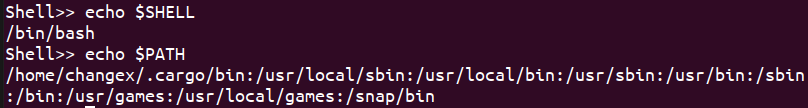

# 实验报告 实验二 PB19000071彭怡腾

## 1、简要介绍

本shell基于rust编写，需要在**linux**环境下编译，编译时请按照如下结构组织Cargo.toml文件和main.rs文件：

```
.
|-  src                     // 放置源文件的目录
    |- main.rs			    // 源文件
|-  Cargo.toml              // Cargo的配置文件
```

编译时，只需要在Cargo.toml目录下运行

```
cargo build
```

即可。编译出的shell程序将位于./target/debug目录下，在此目录下运行

```
./shell
```

即可运行shell程序。

## 2、功能实现

#### 0、可用性

shell会先输出一个“Shell>>”提示等待用户输入，方便观察哪些是输入部分，哪些是输出部分。同时，在处理无效输入和空行时，不会直接退出而是会重新等待下一次输入，正如我们平常使用的shell一样。


#### 1、支持管道

shell实现了支持单个管道符和多个管道符的功能，如下图所示：


在rust中使用如下语句将输入的字符串进行分割，并执行每一条指令：

```rust
    let mut cmds = cmds.trim().split("|").peekable();
    let mut pre_cmd:Option<Child> = None;
```

同时使用如下的语句将输入输出源重定向，使得我们的shell可以支持管道功能：

```rust
                        let stdin = pre_cmd.map_or(Stdio::inherit(),|output:Child| Stdio::from(output.stdout.unwrap()));
                        let stdout = if cmds.peek().is_none() {Stdio::inherit()} else {Stdio::piped()};
```

#### 2、支持重定向

shell支持了重定向功能，如下图所示：


使用如下代码（以“>>”的为例）完成重定向功能，首先判断是否含有“>>”,“>”,“<”，如果有的话，将该命令分割，前面的应为命令，后面的应为文件，然后使用dup()函数储存当前的输入或输出的设备描述符，以在本次重定向之后还原为默认状态。使用open函数和dup2()函数配合实现文本的重定向，将输入或输出源更改为指定的文件。

```rust
        if cmd.contains(">>"){
            let mut redi_input = cmd.trim().split(">>").peekable();
            if let Some(input_cmd) = redi_input.next(){
                args = input_cmd.split_whitespace();
                prog = args.next();
            }
            else{
                println!("You Lose The Command!");
                continue;
            }
            if let Some(output_file) = redi_input.next(){
                unsafe{
                    let c_str = CString::new(output_file.trim()).unwrap();
                    let c_word: *const c_char = c_str.as_ptr() as *const c_char;
                    fd = open(c_word,O_WRONLY| O_CREAT |O_APPEND, 00777);
                    stdout_num = dup(1);
                    dup2(fd,1);
                    index = 1;
                };
            }
            else{
                println!("You Lose The Output_File!");
                continue;
            }
        }
```

#### 3、处理ctrl+D

shell可以处理ctrl+D的按键，如下图所示：


因为ctrl+D实际上为输入EOF，因此当判断读入一个EOF（不是换行符）时，就退出程序，代码如下：

```rust
        //handle ctrl+D
        if 0 == stdin().read_line(&mut cmds).unwrap() {
            println!("");
            exit(0);	// EOF
        }
```


#### 4、处理ctrl+C

shell可以处理ctrl+C的按键，如下图所示：


在输入一半命令的时候输入ctrl+C就会丢弃当前命令进入下一行，而在有程序运行时输入ctrl+C则会打断程序开始新的一行。

由于ctrl+C为输入SIGINT信号，因此使用如下语句注册一个handler函数，对SIGINT信号做简要处理即可。

```rust
let _status = signal::signal(signal::Signal::SIGINT, signal::SigHandler::Handler(handle_sigint));

extern fn handle_sigint(_signal: c_int) {
    println!("#");
    if unsafe{PROMPT_INDEX == 0}{
        print!("Shell>> ");
    }
    stdout().flush().unwrap();
}
```

#### 5、选做部分

实现了两个在实验要求中位于“更多功能”部分的选做。

###### 1、echo $SHELL

这一个命令的含义是，若$号后面的为一个环境变量，则将其输出。如下图所示，本shell实现了这个功能，可以在$号后为环境变量的时候输出对应环境变量的值。



对应的代码略有冗余（主要的冗余是类型转换和使其支持管道），简单来说就是使用函数getenv()判断$号后面的内容是否存在于环境变量之中，若存在则输出其环境变量对应的值，否则使用command()函数调用原来的echo，直接对后面的部分进行输出。

```rust
//echo can print the environment value
             "echo" => {
                    let mut echo_index = 0;
					let env_para = args.clone().next();
                        if let Some(para) = env_para{
                            let mut para_list = para.trim().split("$").peekable();
                            if let Some(temp_text) = para_list.next(){
                                if temp_text == ""{
                                    if let Some(last_text) = para_list.next() {
                                        if last_text != "" {
                                            echo_index = 1;
                                            
                                            //change the stdin and stdout if have pipe
                                            let stdin = pre_cmd.map_or(Stdio::inherit(),|output:Child| Stdio::from(output.stdout.unwrap()));
                                            let stdout = if cmds.peek().is_none() {Stdio::inherit()} else {Stdio::piped()};
                                            
                                            let c_str = CString::new(last_text.trim()).unwrap();
                                            let c_word: *const c_char = c_str.as_ptr() as *const c_char;

                                            unsafe{
                                                let env_value = getenv(c_word);
                                                let mut str_slice: &str  = para;

                                                if env_value != (0x0 as *mut i8){
                                                    let c_str: &CStr = CStr::from_ptr(env_value);
                                                    str_slice = c_str.to_str().unwrap();
                                                }
                                                
                                                let child_status = Command::new("echo").arg(str_slice).stdin(stdin).stdout(stdout).spawn();
                                                match child_status{
                                                    Ok(child_process)=>{
                                                        pre_cmd = Some(child_process);
                                                    }
                                                    Err(err)=>{
                                                        pre_cmd = None;
                                                        eprintln!("{}", err);//not die with wrong input
                                                    }
                                                } 
                                            };                                                
                                        }
                                    }
                                }
                            }
                        }
```

###### 2、A=1 env

这一个命令的含义是，将tabel = value中的tabel临时的添加到环境变量中，如果原变量存在则直接将其覆盖，并且输出当前的环境变量表。如下图所示，本shell实现了这个功能：


中间省略大量环境变量……


同时我们还可以使用上面实现的功能来相互印证正确性。


对应的代码如下所示，简要来说就是判断是不是以“env”结尾，是的话，则把前面的部分按照“=”划分，调用setenv()函数添加新的环境变量即可。

```rust
        //setenv handle after the redirection, also need support pipe
        let end_env = args.clone().last();
        if let Some(end_parm) = end_env{
            if end_parm == "env"{
                let dict_env = prog.clone();
                if let Some(dict_parm) = dict_env{
                    let mut env_list = dict_parm.trim().split("=").peekable();
                    let name = env_list.next();
                    let value = env_list.next();
                    if let Some(env_name) = name{
                        if let Some(env_value) = value{
                            let c_str = CString::new(env_name.trim()).unwrap();
                            let c_name: *const c_char = c_str.as_ptr() as *const c_char;
                            let c_str = CString::new(env_value.trim()).unwrap();
                            let c_value: *const c_char = c_str.as_ptr() as *const c_char;
                            unsafe{setenv(c_name,c_value,1);};
                            let empty_iter = "";
                            args = empty_iter.split_whitespace();
                            prog = Some("env");
                        }
                    }
                }
            }
        }
```

## 3、strace工具